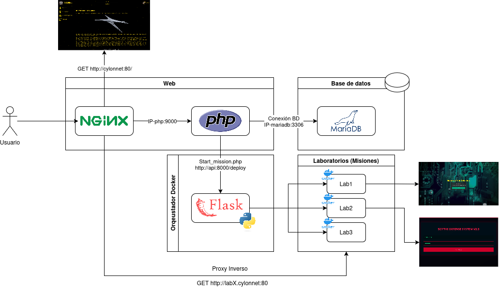

# CYLONNet

> Plataforma de laboratorios de ciberseguridad *CTF‑style* para la Universidad Complutense de Madrid.

---

## Tabla de contenidos

1. [Descripción](#descripción)
2. [Características principales](#características-principales)
3. [Arquitectura del sistema](#arquitectura-del-sistema)
4. [Requisitos](#requisitos)
5. [Instalación](#instalación)
6. [Configuración crítica](#configuración-crítica)
7. [Puesta en marcha](#puesta-en-marcha)
8. [Gestión y creación de misiones](#gestión-y-creación-de-misiones)
9. [Manual de Usuario](#manual-de-usuario)
10. [Contribuir](#contribuir)
11. [Licencia](#licencia)
12. [Contacto](#contacto)

---

## Descripción

CYLONNet es una plataforma web que permite **lanzar y subir laboratorios de hacking** de forma totalmente autoservicio. El proyecto nace como Trabajo Fin de Grado de **Lucas Calzada del Pozo** para la Facultad de Informática (UCM).

* **Frontend:** HTML5, CSS3, JavaScript, jQuery.
* **Backend:** PHP 8.x sobre Nginx y MariaDB.
* **Contenerización:** Docker (+ Docker Compose) con soporte multi‑arquitectura.

La plataforma incluye la gestion de usuarios, misiones, un panel de administración, sistema de tags, XP, flags (*user* & *root*) y un completo manual interactivo que guía al estudiante durante sus primeras misiones.

---

## Características principales

* 💣 **Misiones bajo demanda** (lanzamiento, parada y destrucción automática de contenedores).
* 🏆 **Sistema de puntuación** basado en XP y tags clasificatorios.
* 🔑 **Flags estándar** (`/flag/uflag.txt`, `/root/rflag.txt`).
* 📊 **Panel de administracion** para administradores (añadir administradores, misiones, etc.).
* 🚀 **Soporte de multiples arquitecturas** (Pensado para ejecutarse en cualquier entorno).

---

## Arquitectura del sistema

La plataforma se compone de **cuatro bloques lógicos** comunicados por red interna Docker:

| Bloque | Descripción | Puertos internos |
|--------|-------------|------------------|
| **Web** | NGINX actúa como *reverse-proxy* y termina TLS. Reenvía las peticiones a PHP-FPM, donde vive la aplicación CYLONNet. | `80/tcp` → NGINX → `9000/tcp` (FastCGI) |
| **Base de datos** | Servidor MariaDB que almacena usuarios, misiones, tags, progreso y configuración. | `3306/tcp` |
| **Orquestador Docker** | API REST escrita en Flask + Docker SDK. Recibe órdenes de `start_mission.php` y gestiona el ciclo de vida de los contenedores de laboratorio. | `8000/tcp` |
| **Laboratorios (Misiones)** | Contenedores Docker aislados (`Lab1`, `Lab2`, …) que exponen cada reto en su propio subdominio. | Dinámicos (ej. `8080`, `8081`, …) |

### Diagrama de flujo




## Requisitos

| Componente        | Versión mínima |
| ----------------- | -------------- |
| Docker Engine     | 24.0           |
| Docker Compose v2 | 2.20           |
| PHP               | 8.1            |
| Apache            | 2.4            |
| MariaDB           | 10.11          |

> **Nota:** En entornos de producción se recomienda Linux 5.15 o superior.

---

## Instalación

### 1. Clonar el repositorio

```bash
$ git clone https://github.com/tu‑usuario/cylonnet.git
$ cd cylonnet
```

### 2. Copiar variables de entorno

```bash
$ cp .env.example .env
# Edita los valores según tu entorno
```

### 3. Construir y levantar los servicios

```bash
$ docker compose build
$ docker compose up -d
```

La primera compilación puede tardar varios minutos (dependiendo de la imagen base y la arquitectura).

---

## Configuración crítica

> **Obligatorio antes del primer `docker compose build`:**

| Archivo                       | Qué debo cambiar                                 |
| ----------------------------- | ------------------------------------------------ |
| `cylonnet/includes/app.php`   | **Contraseña de la base de datos** de producción |
| `mariadb/initdb/CYLONNet.sql` | **Contraseña del usuario `cylon_adm` raíz** y *tags* |

No subir nunca estas credenciales al repositorio público.

---

## Puesta en marcha

1. Accede a `http://localhost` o al dominio configurado.
2. Regístrate con tu **correo UCM** y establece una contraseña nueva.
3. ¡Empieza tu primera misión!

> Para acceso externo se recomienda VPN.

---

## Gestión y creación de misiones

### 1. Lanzar una misión

* Navega a **Missions ▶ See contract ▶ Start mission**.
* Espera unos segundos a que el contenedor arranque.

### 2. Flags

* **User flag:** `/flag/uflag.txt`
* **Root flag:** `/root/rflag.txt`

### 3. Crear tu propia misión (modo *Developer*)

1. Crea una imagen Docker vulnerable mediante un `Dockerfile`.
2. Exporta la imagen:

   ```bash
   docker save -o nombre_de_la_maquina.tar.gz nombre_de_la_maquina:latest
   ```
3. En el panel **Developer** súbela y completa la configuración.

#### Ejemplo mínimo de Dockerfile

```Dockerfile
# OJO: para Raspberry Pi usa arm64v8/ubuntu:latest
FROM ubuntu:latest
ENV DEBIAN_FRONTEND=noninteractive
RUN apt-get update && \
    apt-get install -y apache2 mariadb-server php libapache2-mod-php && \
    rm -rf /var/lib/apt/lists/*
COPY index.php /var/www/html/
EXPOSE 80 3306
CMD ["/usr/sbin/apache2ctl", "-D", "FOREGROUND"]
```

#### Compilar para otra arquitectura (buildx)

```bash
# Habilitar multi‑arch
docker run --rm --privileged tonistiigi/binfmt --install all
# Compilar ARMv7
docker buildx build --platform linux/arm/v7 -t labo:armv7 --load .
# Exportar
docker save labo:armv7 | gzip > labo_armv7.tar.gz
```

Para soporte o dudas contacta a [lucalzad@ucm.es](mailto:lucalzad@ucm.es).

---

## Manual de Usuario

El manual completo está disponible en la sección **Ayuda ▶ Manual de Usuario** dentro de la plataforma. Incluye:

* Introducción y primeros pasos.
* Registro e inicio de sesión.
* Lanzamiento y explotación de misiones.
* Creación y subida de nuevos laboratorios.

> También puedes unirte al servidor de Discord para resolver las máquinas junto a otros Cylons: [https://discord.gg/GFPgrRGkMy](https://discord.gg/GFPgrRGkMy)

---

## Contribuir

1. Haz un *fork* del proyecto.
2. Crea tu rama: `git checkout -b feature/mi‑mejora`.
3. Realiza *commit* de tus cambios: `git commit -m "Añade nueva funcionalidad"`.
4. Sube la rama a tu repositorio: `git push origin feature/mi‑mejora`.
5. Abre un *pull‑request* explicando tu aporte.

Por favor sigue las guías de estilo de código y *commits* convencionales.

---

## Licencia

Este proyecto se publica bajo la licencia **MIT**. Consulta el archivo [LICENSE](LICENSE) para más información.

---

## Contacto

* **Desarrollador:** Lucas Calzada del Pozo — [lucalzad@ucm.es](mailto:lucalzad@ucm.es)

---

<p align="center">© 2025 CYLONNet — Todos los derechos reservados.</p>
